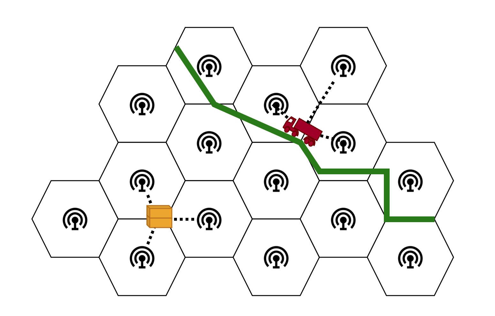
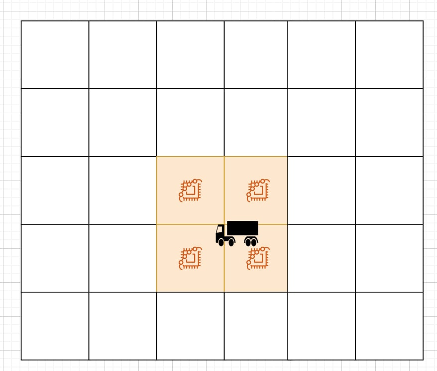
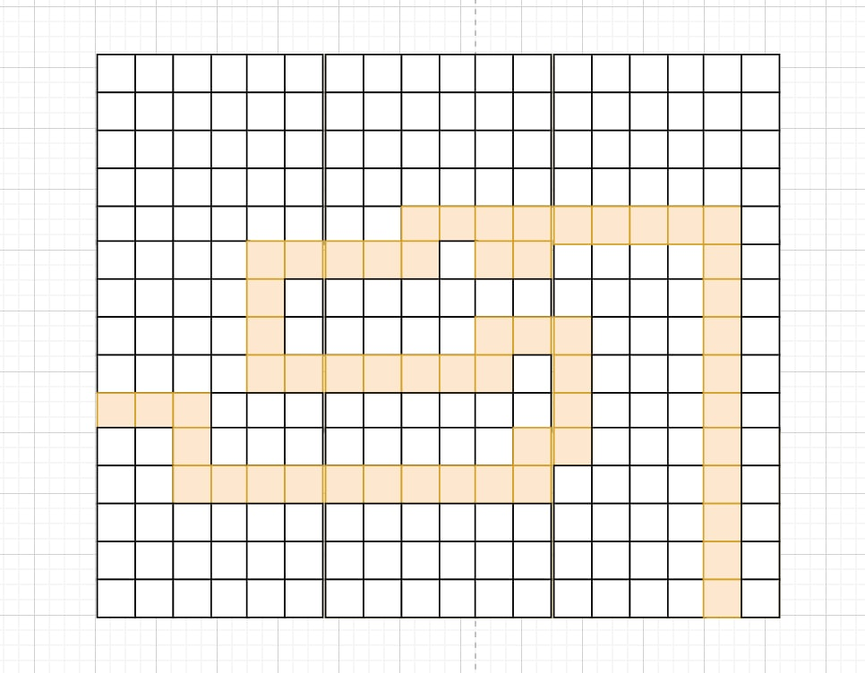

# Concept

## Challenge
Ports currently track ships and trucks, but individual containers are harder to track.
Solutions with cameras exist, but they can’t track containers hidden behind others.
We want to track containers and optimize their transit in a port

## Our solution
It is designed for port operators helping to identify containers that are shipped to the wrong place but also needlessly long routes.

How? Fitting containers with a small, cheap and reusable beacon, and listen for messages with receivers spread throughout the port area.

Beacons are detected by receivers in close proximity, and this is used to pinpoint their location:

With this information, routes in the port can be reconstructed:

## Impact

We provide data on the movement of individual containers. This data can be used to:
- Detect and alert on shipment anomalies
- Find and eliminate inefficient routes
- Route containers based on measured traffic

The overall goal of the system is to reduce environmental impact, fuel usage and transit time of cargo.
