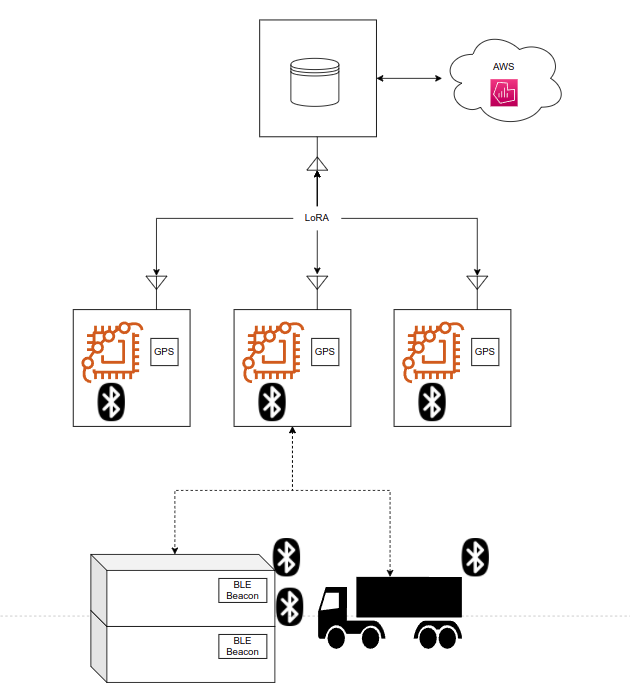

# Technology

## High level diagram

## Components

Our infrastructure is composed of:
- BLE beacons (attached to object of interest)
- Mesh network of receivers communicating to each other via LoRa
- LoRa gateway to collect data from receivers which aggregates it and fowards it to AWS
- Cloud system to collect and store tracking data
- Dashboard to show and query collected information

### BLE beacon
The beacon periodically sends unique identification data over BLE.

The main technical issue is that the device will be attached to every object of interest and should thus be battery powered. Implementation will be done via periodic interrupts from one of the MCU's internal timers. The task is relatively simple, so it imposes no particular constraints on the processor, and power consumption should be the main driving factor in the choice.

The transmission period will be determined through experimentation in order to provide most accurate data without saturating the network. If the evaluation shows this to be required a movement sensor will be added in order to limit the updates if the beacon is stationary.

### Receivers

The receivers are much less power constrained as they can use either direct power connection (if available) or solar panels and accumulators. The role of the receivers is to collect the periodic pings emitted by beacons, timestamp them and send this data over LoRa for collection.

The devices will be implemented using a nucleo f401re board with a BLE receiver and a LoRa antenna. Each received contains a GPS module in order to get accurate position and timing information to tag the received data with.

### Network

The network is split into two components, the BLE section and the LoRaWAN section, with different requirements and tasks.

The BLE section is where most of the traffic will happen, since many containers can be next to each other, while after aggregating the data the load on the LoRa network will be much lower.

### Cloud storage

The tagged and aggregated data is stored on AWS for long term storage. This data can then be queried by operators in order to gain insights on the movement of cargo within the port, such as:
- Areas with high congestion
- Long routes
- Shipment errors

### Frontend

An interactive dashboard will provide a way to visualize the data over the port area and to query it as needed.
