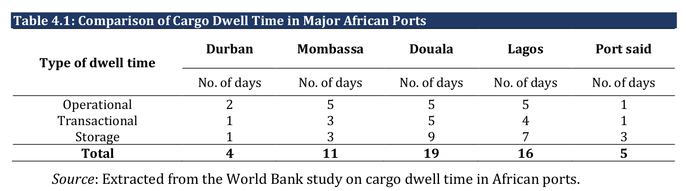
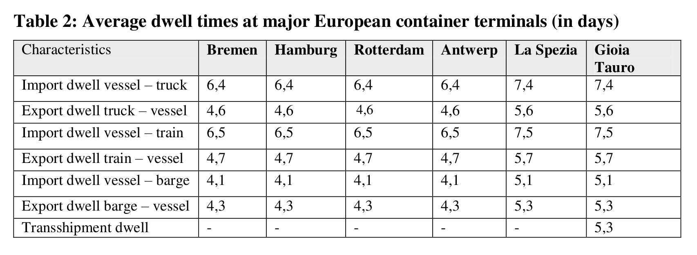

# Evaluation
> This is the final version of this document. The previous version can be found [here](../second_delivery/Evaluation.md)

## Network

The critical network is the BLE one: the traffic on such network will be monitored and depends on number of active beacons and their update frequency.

## Preliminary estimates
- BLE beacon covers 100m range
- Doing some calculations the area of the circle drawn by the beacon is about 31k m²
- A container 12m x 2,5m covers about 30 m²
- Dividing the above areas we get around 1000 containers cover
- Then we can easily suppose that a stack of some containers
- The beacon transmits every minute
- Max 300 byte can be trasmitted
- We need around 32 bytes of data for our system to work, to which BLE headers and Eddystone protocol overhead needs to be added. This leaves us with enough bandwidth to make the system work.

## Power consumption

Power consumption is the most critical on BLE beacons as they have to be battery powered and operate continously for the duration of a containers' stay in the port. We base our analysis on consumption on average dwell times of containers in various worldwide ports.

(From DOI: 10.14254/jsdtl.2018.3-1.7, Journal of Sustainable Development of Transport and Logistics · April 2018)

(From DOI: 10.1080/03088830902861086, Maritime Policy & Management · April 2009)

Given this information, we target a minimum lifetime of around 20 days for the beacons. Power analysis will be performed and compared to the capacity of batteries (most likely 3xAA to remain similar to the receiver board) so that the solution can be evaluated and optimized if necessary. The following optimizations have been implemented to reduce power consumption:

- CPU sleep between timer interrupts
- Powering off the BLE module when not in use

Additionally, the following was considered but ruled out:
- Integrating a motion sensor to reduce ping rate when a container is stationary

## Response time

Power system does not have any user interaction that require a tight bound on response time since it is focused on measuring data for asynchronous analisys. Nonetheless excessive delays are to be avoided and the total latency from BLE ping to web dashboard will be measured and evaluated. Given the non-realtime nature of the system, we target a sub-10s total delay.
