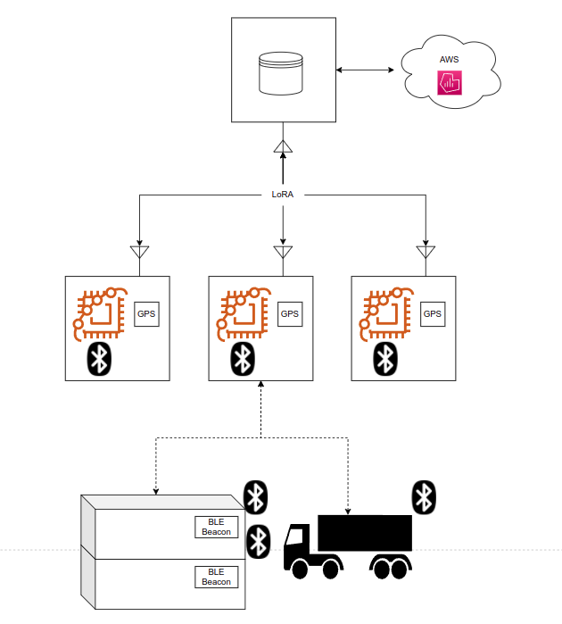
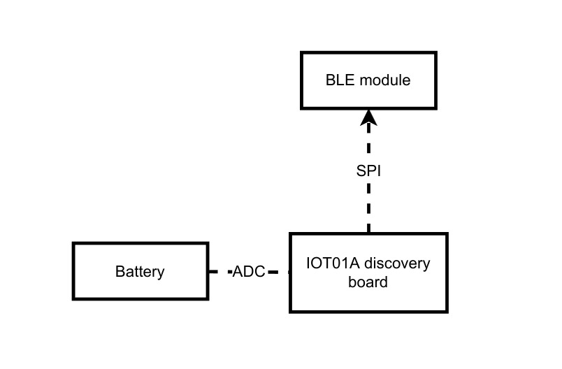
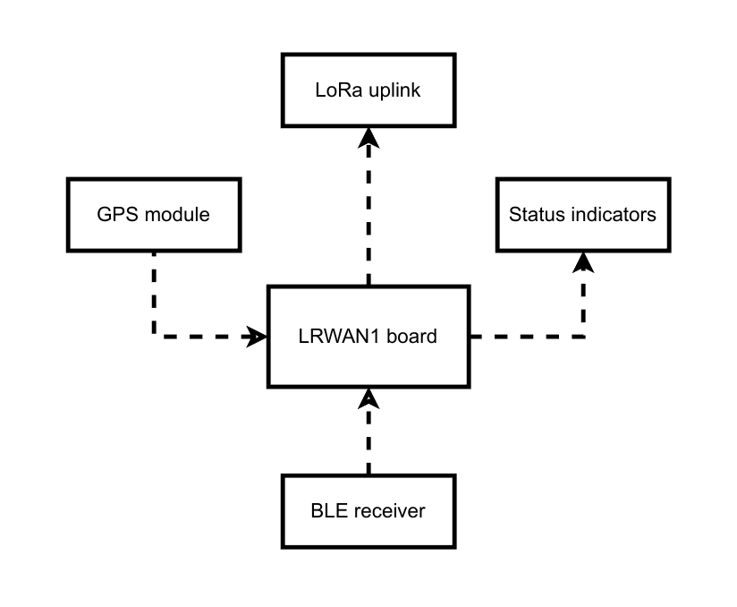
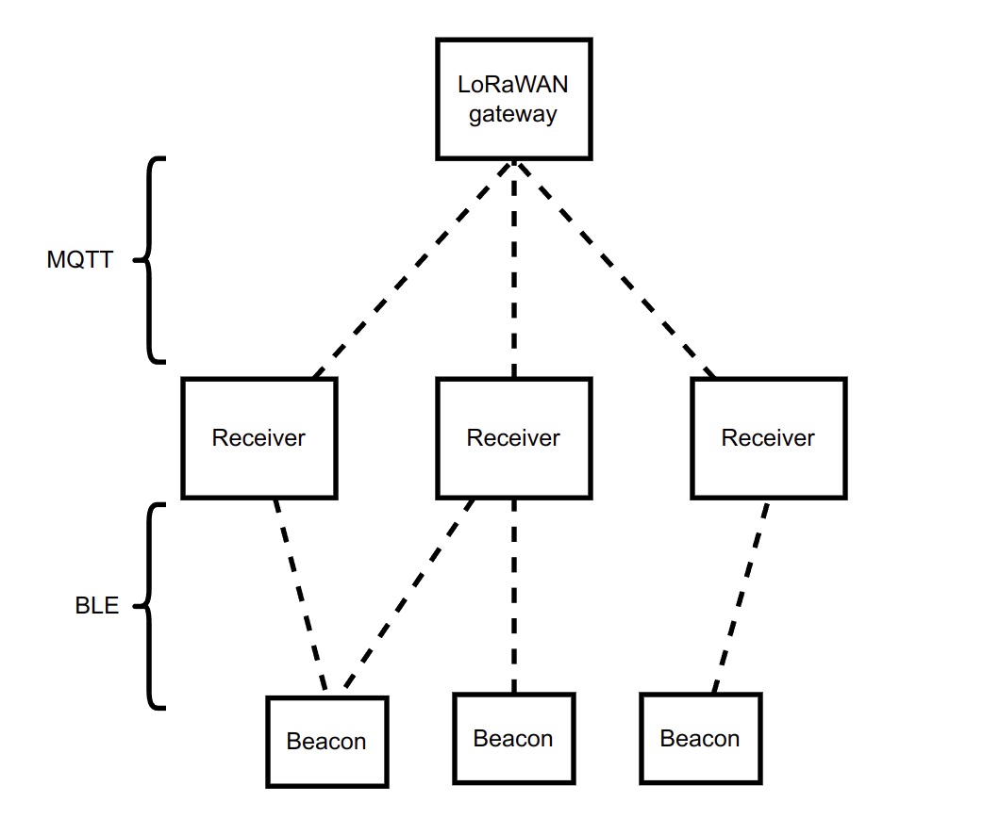

# Technology
> This is the final version of this document. The previous version can be found [here](../second_delivery/Technology.md)

## High level diagram

## Components

Our infrastructure is composed of:
- BLE beacons (attached to object of interest)
- Mesh network of receivers communicating to each other via LoRa
- LoRa gateway to collect data from receivers which aggregates it and fowards it to AWS
- Cloud system to collect and store tracking data
- Dashboard to show and query collected information

### BLE beacon
The beacon periodically sends unique identification data over BLE.

The main technical issue is that the device will be attached to every object of interest and should thus be battery powered. Implementation will be done via periodic interrupts from one of the MCU's internal timers. The task is relatively simple, so it imposes no particular constraints on the processor, and power consumption should be the main driving factor in the choice.

The transmission period will be determined through experimentation in order to provide most accurate data without saturating the network. If the evaluation shows this to be required a movement sensor will be added in order to limit the updates if the beacon is stationary.

The chosen board for this device is the [b-475e-iot01a](https://www.st.com/en/evaluation-tools/b-l475e-iot01a.html), which features an onboard SPBTLE-RF module for BLE communication. One of the main tasks in making this device work was to add support for the BLE module, as it was not supported by RIOT OS. This required multiple steps:
- At first, support for the SPI2 and SPI3 buses was added to RIOT OS for it to be able to communicate with the device in the first place. [Pull request here](https://github.com/RIOT-OS/RIOT/pull/17885)
- Once the MCU could communicate with the device, we tried to integrate it with the already supported NimBLE stack. This proved to be a very involved process, and we opted not to continue with it as it would require updating the NimBLE stack first, then the RIOT interface, all for a relatively old chip that doesn't support the most recent BLE protocol. Given the time at our disposal, we decided to instead port the simpler [stm32duino/SPBTLE-RF](https://github.com/stm32duino/SPBTLE-RF) library, which was meant for Arduino, to RIOT. The ported library can be found [here](https://github.com/dp1/SPBTLE-RF-RIOT). Porting required changing all APIs to RIOT's and moving some SPI handling code out of the interrupt handler and into its own thread, as SPI in ISR isn't well handled in RIOT and leads to frequent crashes.
- Finally, we added support for the [BLE Observer](https://github.com/dp1/SPBTLE-RF-RIOT/blob/main/spbtlerf/observer.cpp) role to our ported library, as it only supported the Beacon role when we started using it

### Receivers

The receivers are much less power constrained as they can use either direct power connection (if available) or solar panels and accumulators. The role of the receivers is to collect the periodic pings emitted by beacons, timestamp them and send this data over LoRa for collection.

The devices are implemented using a [b-l072z-lrwan1](https://www.st.com/en/evaluation-tools/b-l072z-lrwan1.html) board with a BLE receiver shield and the integrated LoRa antenna. At first we tried using the [i-nucleo-lrwan1](https://www.st.com/en/evaluation-tools/i-nucleo-lrwan1.html) shield on top of a [nucleo-f401re board](https://www.st.com/en/evaluation-tools/nucleo-f401re.html) with no success, as it required both hardware modifications of the board and wouldn't complete a LoRa join procedure after we implemented the required communication routines. Each receiver contains a GPS module in order to get accurate position and timing information to tag the received data with.

### Network

The network is split into two components, the BLE section and the LoRaWAN section, with different requirements and tasks.

The BLE section is where most of the traffic will happen, since many containers can be next to each other, while after aggregating the data the load on the LoRa network will be much lower.

### Cloud storage

The tagged and aggregated data is stored on AWS for long term storage. This data can then be queried by operators in order to gain insights on the movement of cargo within the port, such as:
- Areas with high congestion
- Long routes
- Shipment errors
