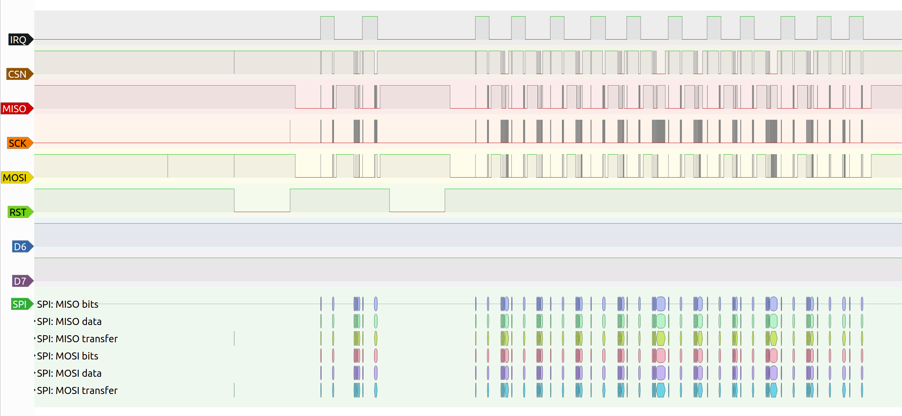
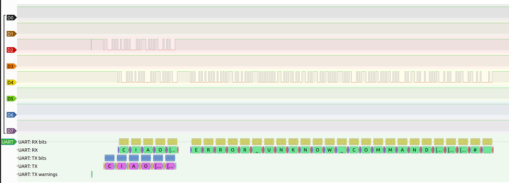
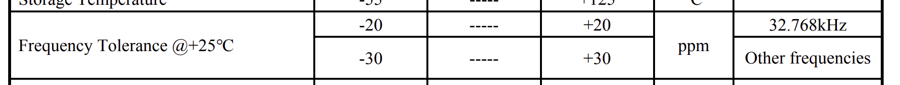

# Second delivery

## Comments from the first delivery

---

> Why is tracking individual containers in the port key?

We decided to track individual containers to offer a more granular tracking. In
particular, we track a container's route as a single entity even if it is moved
around by different trucks in various steps during its port stay. Compared to
tracking trucks/cranes only, this provides higher level information on paths so
that optimizations aren't limited to rerouting a whole shipment but decisions
such as moving a set of goods to different trucks can be made.

<!-- ### The first slide mentions a problem regarding the routing of trucks to identify a container. Is this supported by a report?

asd -->

> Quantitative requirements

<!--
### Can you provide quantitative requirements
### reducing the power to achieve what requirement?
### How often are you sampling? How often are you transmitting?
### give us a rough idea of what is the expected life-time and whether BLE fits -->

We target a minimum beacon lifetime of 20 days based on port dwell times
of various worldwide ports. See [evaluation](Evaluation.md) for further details.
Battery capacity and power constraints will follow from this requirement.

Regarding the network communication, we will need to respect the LoRa bandwidth
limits, and this will be evaluated for the next delivery. BLE doesn't have
constraints other than the available bandwidth, which needs to be shared among
potentially thousands of beacons in the same area. Preliminary evaluation
leads to a once per minute ping rate from each beacon.

> Is BLE inside or outside the container? The inside is a metal cage

Placing a beacon on the inside of a container would severely limit its usefulness
and would also require opening each incoming and outgoing container. Thus,
beacons will be placed on the outside of container via e.g. magnetic attachment.

> It's nice that the receiver has GPS, but being stationary what is the purpose?

We are including a GPS module in our receivers in order to get accurate timestamps
to tag incoming packets with, as other time sources are not accurate enough in the
long term. See [technology](Technology.md) for further details on this necessity.

Since we need the radio already, we can make use of it for location as well, leading
to:
- No need for an operator to input the receiver location on setup
- Smaller chance of human error during the setup procedure
- Potentially higher accuracy
- No need to change location information if the receiver is relocated

<!-- fewer setup steps, we need gps for timestamps anyways
Why not the internal rtc? Our board doesn't have an external crystal, and even if it had one (like on the nucleo board)
typical accuracies are in the +-20ppm range, which translates to a drift of ~50s/month -->

> How do you plan to estimate the position by BLE?

This part requires more evaluation which will be done for the third delivery. At the
moment we are planning on using RSSI to evaluate a beacon's distance from each
receiver and from this estimate each beacon's position during data postprocessing.

<!-- ### You need to look into "Localization services" this is a special class of algorithms that can estimate the location of a device based on beacons. -->

<!--
### in the impact slides you are very clear but those metrics are not evaluated
power consumption
network usage -->

<!-- ### There is a special class of devices that use an Arm cortex-M along with BLE and are used for this purpose. You need to include them on the slides. -->

## Changes since the first delivery
---

The main idea remains the unchanged, while most of the technical implementation was subject to modifications. In particular, we changed the hardware platform since the first setup could not work for both hardware (pin conflicts) and software (unsupported hardware, potentially old firmware on the shield) problems.

|Item|Before|Now|Reason for change
|-|-|-|-|
|Receiver board|Discovery IOT01a|LRWAN1 discovery|Onboard LoRa module instead of shield|
|Beacon BLE shield|X-NUCLEO-IDB05A1|Onboard SPBTLE-RF module|Needed for the receiver|
|Beacon board|Nucleo f-401re|Discovery IOT01a|Onboard BLE module|

## Technical work done since the first delivery
---

### BLE Support

The chosen board for the beacon is the [b-475e-iot01a](https://www.st.com/en/evaluation-tools/b-l475e-iot01a.html), which features an onboard SPBTLE-RF module for BLE communication. One of the main tasks in making this device work was to add support for the BLE module, as it was not supported by RIOT OS. This required multiple steps:
- At first, support for the SPI2 and SPI3 buses was added to RIOT OS for it to be able to communicate with the device in the first place. [Pull request here](https://github.com/RIOT-OS/RIOT/pull/17885)
- Once the MCU could communicate with the device, we tried to integrate it with the already supported NimBLE stack. This proved to be a very involved process, and we opted not to continue with it as it would require updating the NimBLE stack first, then the RIOT interface, all for a relatively old chip that doesn't support the most recent BLE protocol. Given the time at our disposal, we decided to instead port the simpler [stm32duino/SPBTLE-RF](https://github.com/stm32duino/SPBTLE-RF) library, which was meant for Arduino, to RIOT. The ported library can be found [here](https://github.com/dp1/SPBTLE-RF-RIOT). Porting required changing all APIs to RIOT's and moving some SPI handling code out of the interrupt handler and into its own thread, as SPI in ISR isn't well handled in RIOT and leads to frequent crashes.
- Finally, we added support for the [BLE Observer](https://github.com/dp1/SPBTLE-RF-RIOT/blob/main/spbtlerf/observer.cpp) role to our ported library, as it only supported the Beacon role when we started using it

(SPI interaction with the BLE chip, once the library worked)

## LoRa support

Before moving to the onboard LoRa module of the LRWAN1 board, we tried to make the [I-NUCLEO-LRWAN1](https://www.st.com/en/evaluation-tools/i-nucleo-lrwan1.html) shield work. This involved a few steps.

At first, we had to understand how the shield works and how to communicate with it, as the RIOT OS library only supports talking to the LoRa chipset directly via SPI. In the case of our shield, this was not possible, as a second STM32 MCU sits between our main processor and the chip. This MCU is factory programmed with an old firmware that accepts AT commands, so we tried to interface with it via serial. After changing board in order to have access to a serial port of the right pins (pins D0 and D1 on the nucleo board arent' connected to the cpu as the serial port is used for communication to the ST-LINK debugger), we realized that RIOT's AT library couldn't handle our chip, so we tried patching it in order to communicate. After this was done, we managed to start a join procedure with the shield, but it never terminated. From our TTN console we could see all the relevant packets and even the acknowledgement being sent back to our board, but we never received any notification from the chip and couldn't communicate further. Analysis with a logic analyzer proved that nothing was being sent on the serial port, so we suspect that the firmware version is too old (LoRa 1.0.1 instead of the 1.0.2 on the integrated board) and doesn't handle the join procedure correctly. we refrained from doing a firmware upgrade on the shield as various posts about this stated that the read protection on it would render it unusable after any mistake and it wasn't worth the risk.

(Serial communication with the LoRa shield, showing the variant of the AT protocol used)

Luckily we were able to get access to the LRWAN1 board, so we switched to it and used RIOT's driver in order to communicate properly.

## Functionality yet to be implemented
---

With most of the hardware/firmware decisions made, the part that is still missing is the data processing pipeline implemented on the cloud and the corresponding web dashboard that provides access to the results.

## Evaluation conducted so far
---

Given the complexity of the technical challenges we faced, we had limited time to perform a proper evaluation. We managed to complete an evaluation of the GPS solution that motivates our need to include it, and the results are shown below.

While beacons can be replaced relatively frequently, receivers need to be placed in harder to access areas such as on top of light poles in order to get the best possible coverage. With this in mind and also considering that they need to be in sync over time for the localization protocol to work, clock drift is a critical aspect: while absolute time is not important, the relative drift between receivers can leads to inaccurate results, especially after it accumulates over time. Thus, we need some form of external synchronization to keep the system working.

The first and simplest solution would be to use the onboard RTC that is present inside the STM32 SoCs. It uses an external low frequency crystal, which is installed by default on some of the nucleo boards, and can be soldered on if necessary on the others. The following is an excerpt from its datasheet (model number ABS25 from Abracon)

In the worst case, we can have two receivers that drift in opposite directions by up to 50 seconds each month (considering the ±20 ppm drift on the 32KHz crystal) and this problem is only exacerbated when reasoning on longer timescales, such as a reasonable receiver lifetime of 5-10 years. Clearly, any sort of synchronization requirement by the localization protocol would be violated relatively quickly, and thus the RTC cannot be considered as a reliable way to timestamp packets.

Given the placement of receivers, GPS would work unimpeded and we can still use the RTC for timekeeping on shorter timescales if a signal isn't available for e.g. electromagnetic interference from nearby machinery or weather conditions.

## Evaluation yet to be performed
---

The main evaluation of our system is still to be done. In particular we will be measuring the power consumption of the beacons, and the network usage of the whole system.

### Power consumption

We will evaluate power consumption and its relationship with the beacon ping rate in order to assess the needed battery capacity. If the power consumption proves to be too high, we will implement some or all of the following power saving optimizations:

- CPU sleep between timer interrupts
- Powering off the BLE module when not in use
- Integrating a motion sensor to reduce ping rate when a container is stationary

The measurement will be done using an INA219 sensor as described [here](https://github.com/ichatz/riotos-apps/tree/main/temperature_humidity). We will try to correlate power consumption and ping rate with multiple measurements over time to find the best combination.

### Network usage - LoRa

The main board we use for our receiver is supported in IoT-Lab, and thus an analysis of the LoRaWAN network usage will be performed there to simulte the presence of multiple nodes at the same time. This evaluation will require a mock implementation of the BLE shield, which isn't present on the boards that we can have access to, but it will allow us to gather important information on how well we use the network regardless, by simulating the reception of beacon pings.

### Network usage - BLE

BLE evaluation is more complex, as IoT-Lab doesn't offer access to this network. We will perform an evaluation on the devices we have and scale up the network usage according to the estimated number of containers in reach of a receiver
